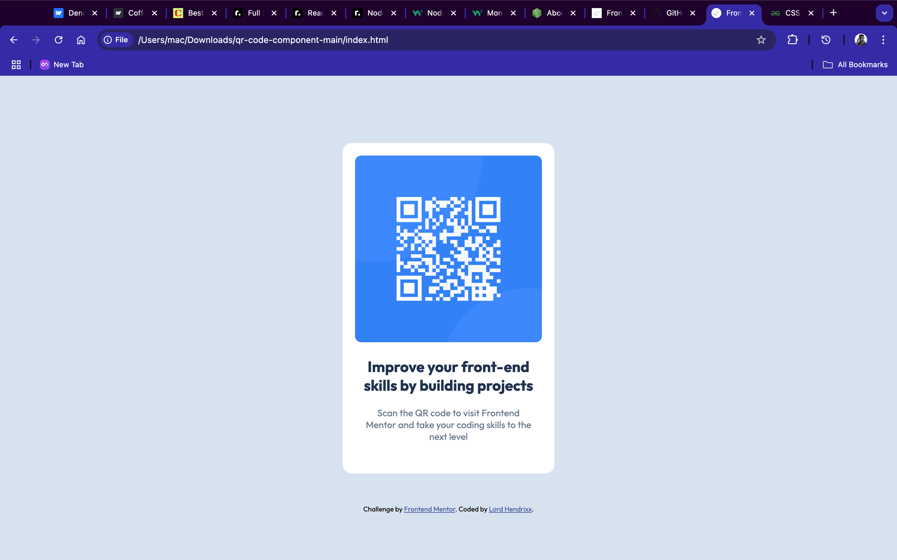

# Frontend Mentor - QR code component solution

This is a solution to the [QR code component challenge on Frontend Mentor](https://www.frontendmentor.io/challenges/qr-code-component-iux_sIO_H). Frontend Mentor challenges help you improve your coding skills by building realistic projects. 

## Table of contents

- [Overview](#overview)
  - [Screenshot](#screenshot)
  - [Links](#links)
- [My process](#my-process)
  - [Built with](#built-with)
  - [What I learned](#what-i-learned)
  - [Continued development](#continued-development)
  - [Useful resources](#useful-resources)
- [Author](#author)
- [Acknowledgments](#acknowledgments)

## Overview

### Screenshot
  

### Links
- Solution URL: [fem-qr-component-project](https://fem-qr-component-project.vercel.app/);

## My process
  - I paid close attention to the style-guide.md to get my project as close to the design as possible.
  
### Built with

- Semantic HTML5 markup
- CSS custom properties
- Flexbox
- Mobile-first workflow

### What I learned

I learnt 
- how useful and delicate the css flexbox is, how it all boils down to proper nesting and structure.
- how to apply responsive web design with media queries to fit different user screen and how to use a mobile-first design in mind.

### Continued development
I want to delve deeper into css flexbox and fully understand semantic layout and structure to improve its efficiency.
I also want more practice with responsive web design to fully master it.

### Useful resources

- [W3 SCHOOLS](https://w3schools.com) - This helped me with understanding the syntax for responsive web design with media queries.

## Author

- Website - [Hendrixx](https://www.your-site.com)
- Frontend Mentor - [@BeeAlmighty](https://www.frontendmentor.io/profile/BeeAlmighty)

## Acknowledgments
I really want to thank w3 schools for how concise and helpful their contents are.
